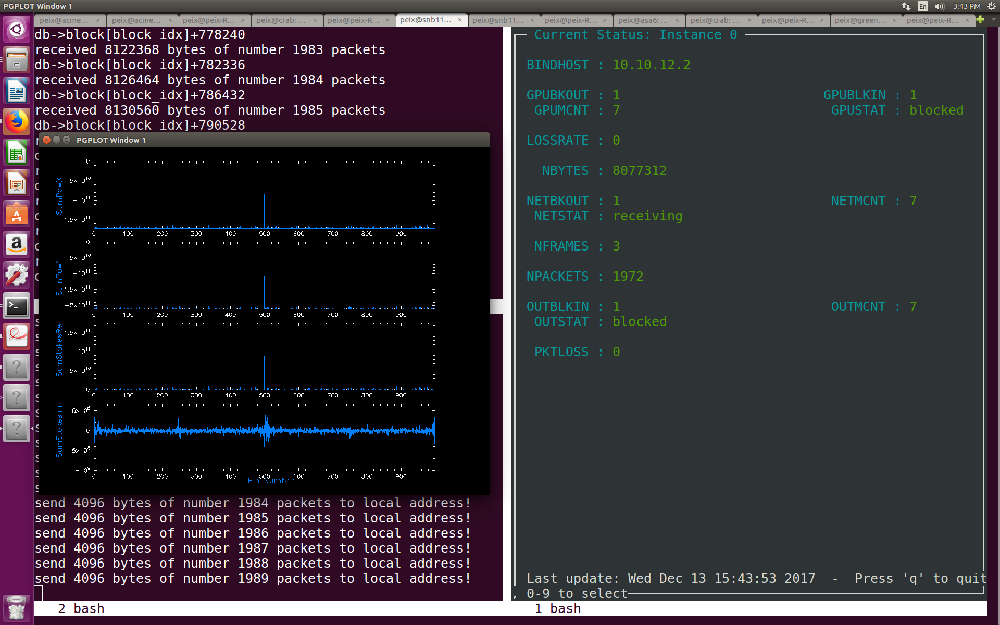

# demo3_hashpipe
In this tutorial, a GPU thread perform PFB,FFT,Correlation and Accumulation will be implemented. And the Output thread will write the processed data to a file in filterbank format.The Net thread is the same with demo2.

First, you can download and install this demo through following step:
```javascript
git clone https://github.com/SparkePei/demo3_hashpipe.git
cd demo3_hashpipe
make
```
And then,you can open your Hashpipe instance by:
```javascript
./demo3_init.sh
```
Three threads will be opened for packets receiving, GPU processing and filterbank data writing.
You need send some packets to your local Ethernet port, otherwise you couldn't receive anything. We wrote a python code to read data from a file and send the data to a local port.You need open a new terminal and run:
```javascript
python ./send_packet.py
```
To monitor the run time status of Hashpipe, you can open a new terminal and run:
```javascript
hashpipe_status_monitor.rb
```
A plot of Full-Stokes will be shown simutaneously, Fig. 1 shows how does demo3 looks like.

> Fig. 1 demo3's screen capture

The GPU code of this demo is from CASPER tutorial 5, which was written by Mark Wagner and Jayanth Chennamangalam.You can find it [in here.](https://casper.berkeley.edu/wiki/Tutorial_5:_Heterogeneous_Instrumentation)
